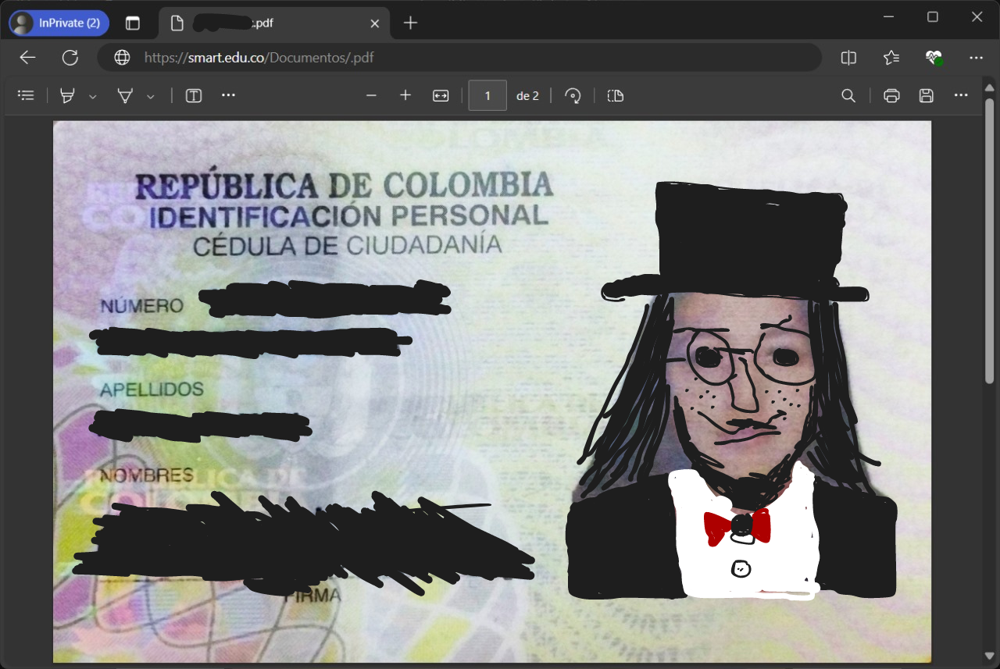
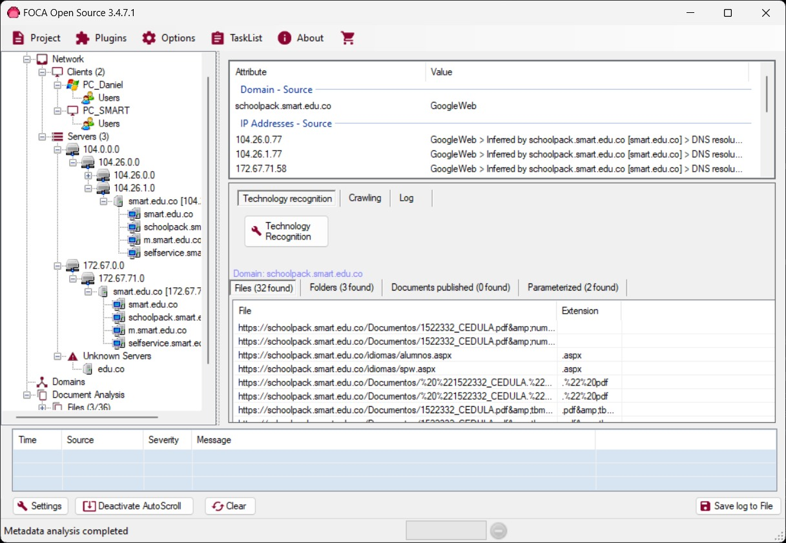

# 📂 Documentación de Exposición de Documentos y Metadatos Sensibles

## 📝 Descripción

Este repositorio está destinado a documentar la exposición de documentos sensibles, incluyendo documentos de identidad de usuarios, datos de menores de edad, hojas de vida, entre otros documentos sensibles en las organizaciones, encontrados en múltiples sitios web públicos. La exposición de esta información presenta un grave riesgo para la privacidad y seguridad de los individuos afectados. Es fundamental abordar este problema de manera efectiva para proteger la información personal y prevenir abusos.

## 🔍 Detalles del Incidente

**📅 Fecha y Hora de Descubrimiento:** 14 JUL 2024 - 11:45 P.M

**🔎 Descripción del Problema:**

Se ha identificado que una gran cantidad de documentos personales, incluidos números de identidad, registros de menores y currículos, han sido expuestos públicamente en diversas plataformas. Estos documentos contienen información altamente sensible, lo que aumenta el riesgo de suplantación de identidad, fraudes y otros delitos relacionados. La exposición de datos de menores de edad es particularmente preocupante debido a las estrictas leyes de protección de información personal.

Además, gracias a la revisión de los metadatos de los ficheros expuestos, se ha podido enumerar información adicional crítica, incluyendo:

- **🌐 Redes Internas:** Detalles sobre redes internas que pueden estar expuestas a ataques.
- **🔧 Servicios:** Información sobre servicios en funcionamiento que podrían ser vulnerables.
- **🛠️ Versiones de Software:** Versiones de software utilizadas que podrían tener vulnerabilidades conocidas.
- **💻 Servidores Internos:** Información sobre la infraestructura de servidores internos que podría ser aprovechada para ataques.

**🌐 Sitios Web Afectados:**

- colombiacompra.gov.co
- invias.gov.co
- herazmomeoz.gov.co
- secop.gov.co
- ramajudicial.gov.co
- micolombiadigital.gov.co
- inpec.gov.co
- hospitaldelrosario.gov.co
- hospitalneiva.gov.co
- crq.gov.co
- procuraduria.gov.co
- queremosdatos.co
- 4-72.com.co
- udistrial.edu.co
- pereira.gov.co
- cnsc.gov.co
- fedepalma.org
- credivalores.gov.co
- enjambre.gov.co
- cloudfront.net
- boyaca.gov.co
- ani.gov.co
- smart.edu.co
- iica-ecuador.org
- vip.ucaldas.edu.co
- min.pereira.gov.co
- boyaca.gov.co
- civil.uis.edu.co
- sedcaqueta.gov.co
- contratos.empocaldas.com.co
- uptc.edu.co
- matriculas.udenar.edu.co

## 🚨 Impacto

La divulgación de estos documentos tiene implicaciones graves:

- **🔒 Riesgo de Robo de Identidad:** La información expuesta puede ser utilizada para cometer fraudes, suplantaciones y otros delitos financieros.
- **👶 Impacto en Menores de Edad:** La exposición de datos de menores está sujeta a protección legal adicional. Su divulgación puede tener serias repercusiones legales y emocionales.
- **🔍 Violación de la Privacidad:** La exposición sin consentimiento adecuado representa una grave violación de la privacidad de los afectados, afectando su bienestar y seguridad.
- **🛡️ Riesgo de Ataques Cibernéticos:** La información sobre redes internas, servicios, versiones de software y servidores internos aumenta el riesgo de ataques cibernéticos dirigidos a las vulnerabilidades identificadas.

### Impacto para las Organizaciones

- **💼 Daño a la Reputación:** La exposición de datos sensibles puede perjudicar gravemente la reputación de las organizaciones afectadas, disminuyendo la confianza de sus clientes y socios.
- **💸 Consecuencias Financieras:** Las organizaciones pueden enfrentar sanciones, multas y costos asociados con la remediación del problema, además de posibles demandas de los afectados.
- **🔧 Interrupciones Operativas:** La necesidad de abordar y corregir las vulnerabilidades expuestas puede causar interrupciones en las operaciones normales y requerir recursos adicionales para resolver el problema.
- **📉 Pérdida de Confianza del Cliente:** Los clientes pueden perder la confianza en la capacidad de la organización para proteger su información, lo que puede resultar en una pérdida de clientes y oportunidades de negocio.
- **📜 Violación de Políticas de Tratamiento de Datos y Privacidad:** La exposición representa una clara violación de las políticas de tratamiento de datos y privacidad, que podrían resultar en acciones legales y sanciones por incumplimiento de regulaciones como GDPR, CCPA, o leyes locales de protección de datos.

## 📁 Evidencias

Las pruebas de la exposición están disponibles en la carpeta `Evidence/`. Esta carpeta incluye capturas de pantalla, enlaces y otros documentos relevantes que demuestran la exposición. Accede a las evidencias aquí:

[Evidence Folder](Evidence/)

**📸 Ejemplos de Información Expuesta:**

- **Captura de Pantalla 1:** Documents Leak.

    

- **Captura de Pantalla 2:** Metadata Leak.

    

## ✅ Acciones Recomendadas

Para abordar la exposición de documentos sensibles, se recomienda realizar las siguientes acciones:

### Para las Plataformas Afectadas:

- **🗑️ Eliminar Documentos Expuestos:**
   - **Inmediatamente eliminar** los documentos sensibles que se encuentran expuestos. Esto incluye eliminar los archivos, registros y cualquier otra información que esté públicamente disponible.
   - Verificar que los documentos no estén accesibles a través de búsquedas internas en el sitio o mediante enlaces directos.

- **🔒 Revisar y Reforzar la Seguridad:**
   - Realizar una **evaluación de seguridad completa** del sistema para identificar y corregir las vulnerabilidades que permitieron la exposición.
   - Implementar medidas de seguridad adicionales, como **control de acceso** adecuado, **cifrado** de datos sensibles y **autenticación** fuerte.

- **📣 Informar a los Afectados:**
   - Notificar a las personas cuyos documentos han sido expuestos, proporcionando información sobre los pasos que están tomando para remediar el problema y los recursos disponibles para proteger su información personal.
   - Ofrecer asistencia a los afectados, como servicios de monitoreo de crédito o asesoría sobre cómo manejar el posible uso indebido de su información.

- **📝 Actualizar Políticas de Privacidad y Procedimientos:**
   - Revisar y actualizar las **políticas de privacidad** y los procedimientos de manejo de datos para asegurar que cumplan con las regulaciones vigentes y protejan adecuadamente la información personal.
   - Asegurarse de que todos los empleados y socios estén capacitados en las mejores prácticas para el manejo de información sensible.

- **🔍 Monitorear y Auditar Regularmente:**
   - Implementar un sistema de **monitoreo continuo** para detectar y responder a posibles futuros incidentes de exposición de datos.
   - Realizar auditorías regulares para evaluar la efectividad de las medidas de seguridad y la conformidad con las políticas de privacidad.

### Acciones Generales:

- **🚨 Notificación a las Autoridades:**
   - Informar a las autoridades pertinentes sobre la exposición para que se tomen medidas correctivas y se protejan los datos de los afectados.

- **🛠️ Colaboración con Expertos en Seguridad:**
   - Trabajar con expertos en seguridad cibernética para realizar una investigación exhaustiva y mitigar el riesgo de futuros incidentes.

- **📚 Concientización y Prevención:**
   - Promover la **concientización sobre la seguridad** entre los empleados y usuarios para prevenir la exposición de datos sensibles en el futuro.
   - Implementar programas de capacitación y sensibilización sobre protección de datos y mejores prácticas de seguridad.

## 🚧 Estado de las Notificaciones

Se ha notificado a las organizaciones afectadas sobre la exposición de los documentos. Sin embargo, la mayoría de las organizaciones no han tomado medidas para remediar la situación. Estoy disponible para colaborar y asistir en la mitigación de estos riesgos, y para proporcionar apoyo adicional en la resolución del problema.

## ⚠️ Aviso Legal

La información contenida en este repositorio se proporciona con el fin de alertar sobre la exposición de datos sensibles y facilitar la corrección de vulnerabilidades. La explotación o uso indebido de esta información está estrictamente prohibido. Este repositorio no debe ser utilizado para fines ilegales o no éticos. Cualquier acción realizada con esta información debe estar en conformidad con las leyes aplicables y respetar la privacidad y derechos de los individuos afectados.

## 📧 Contacto

Para consultas adicionales o para informar sobre nuevas exposiciones, por favor contacta a:

- Guillermo Salgado
- guillo.salgado@outlook.com

---

Gracias por tu atención a este grave asunto. Tu colaboración es esencial para resolver este problema y proteger la información personal de los afectados. 🙏
